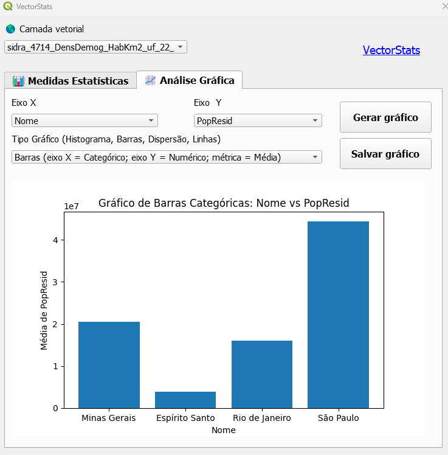
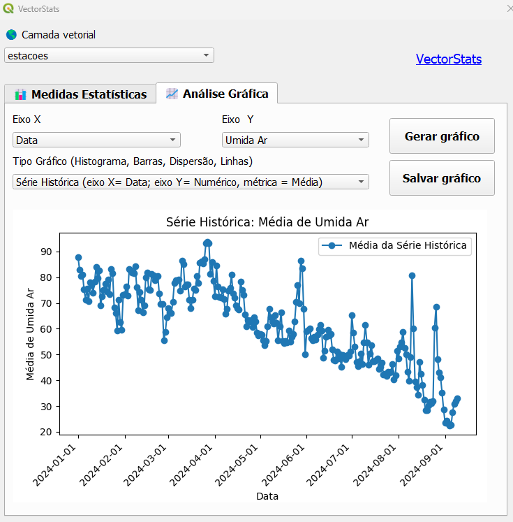

# VectorStats
Plugin do software de informação geográfica **QGIS**.

O plugin tem como objetivo facilitar a análise descritiva e estatística de arquivos vetoriais, com geração de gráficos e medidas estatísticas.

📊 **Medidas Estatísticas**: 

A primeira aba do plugin tem o intuito de gerar medidas estatísticas, como média, mediana, desvio padrão entre outras.

📈 **Análise Gráfica**:

Na segunda aba, o usuário pode gerar gráficos que ajudam a interpretar visualmente os dados das camadas vetoriais, como:

Histograma

Barras Médias

Serie Histórica 

🛠️ **Requisitos**
QGIS 3.x ou superior.
Camadas vetoriais carregadas no projeto.

