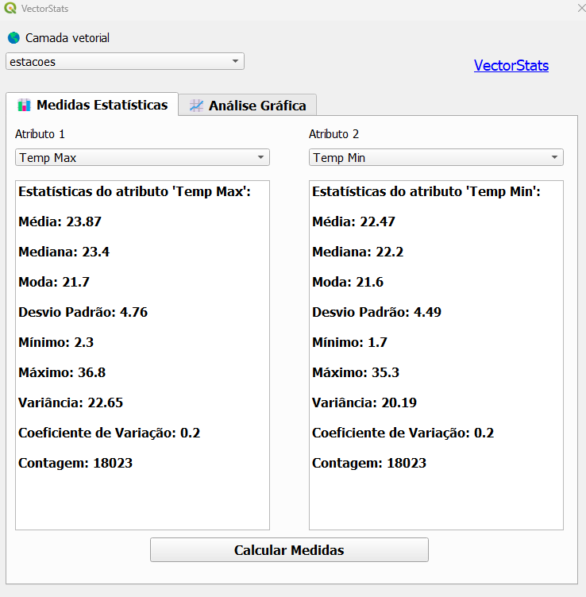
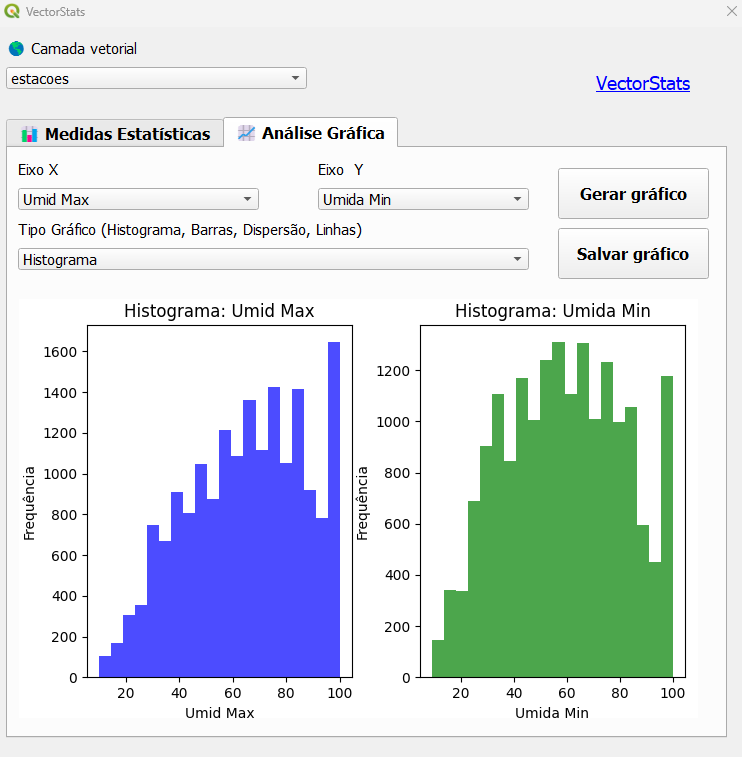

# VectorStats
Plugin do software de informação geográfica **QGIS**.

O plugin tem como objetivo facilitar a análise descritiva e estatística de arquivos vetoriais, com geração de gráficos e medidas estatísticas.

##📊 Medidas Estatísticas: 

A primeira aba do plugin tem o intuito de gerar medidas estatísticas, como média, mediana, desvio padrão entre outras.

##📈 Análise Gráfica:

### Histograma

