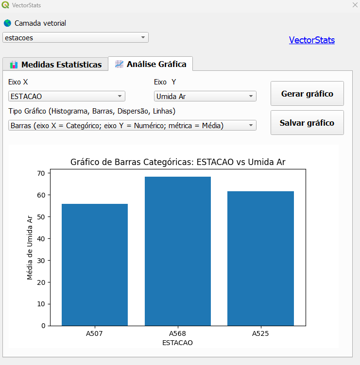

# VectorStats
Plugin do software de informação geográfica **QGIS**.

O plugin tem como objetivo facilitar a análise descritiva e estatística de arquivos vetoriais, com geração de gráficos e medidas estatísticas.

📊 **Medidas Estatísticas**: 

A primeira aba do plugin tem o intuito de gerar medidas estatísticas, como média, mediana, desvio padrão entre outras.

📈 **Análise Gráfica**:

### Histograma

### Barras Médias

